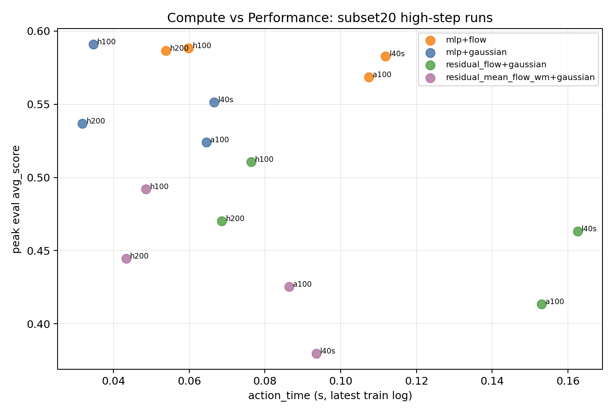
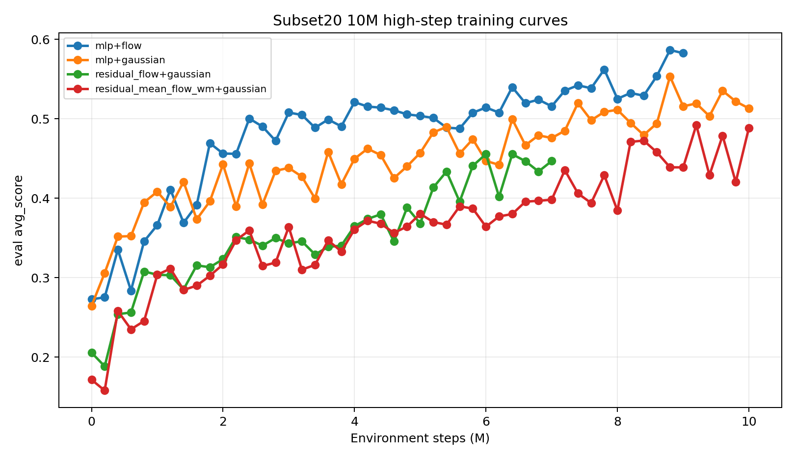

# Ablations and Insights

Generated: 2026-06-10 EDT

Source metrics:

- Local run logs: `outputs/logs/soup/1/*/metrics.jsonl`
- Generated tables/figures: `docs/assets/ablation_insights_20260610/`
- W&B project: https://wandb.ai/danny010324/newt-flow-2x2

Important caveat: `mean +/- std` below is over completed local runs across GPU/replicate labels, not over independent random seeds unless explicitly stated.

## Architecture Ablation

### WM x Policy 2x2

Protocol: subset40, 5M online steps, 50k demo pretraining, state observations, closed-loop planning eval.

| WM | Policy | Runs | Final avg_score | Peak single run | Interpretation |
| --- | --- | ---: | ---: | ---: | --- |
| MLP | Flow | 4 | 0.321 +/- 0.012 | 0.339 | Best subset40 2x2 architecture. |
| MLP | Gaussian | 4 | 0.291 +/- 0.018 | 0.308 | Strong baseline, below MLP+flow. |
| Flow | Flow | 4 | 0.119 +/- 0.015 | 0.136 | Pure flow WM remains weak. |
| Flow | Gaussian | 4 | 0.106 +/- 0.023 | 0.136 | Pure flow WM remains weak. |

Figure:

Training curves:

Conclusion:

- The strongest signal is not replacing the world model with pure flow.
- The best 2x2 result is **MLP WM + flow policy**, suggesting the policy prior is a better first target than fully replacing the latent dynamics.

### Flow-WM Variants

Protocol: subset40, 5M online steps, 50k demo pretraining, Gaussian policy, state observations, closed-loop planning eval.

| WM variant | Runs | Final avg_score | Peak single run | Interpretation |
| --- | ---: | ---: | ---: | --- |
| residual_flow | 4 | 0.232 +/- 0.027 | 0.256 | Best flow-WM family result, but still below MLP WM. |
| shortcut_residual_flow_wm | 4 | 0.232 +/- 0.016 | 0.245 | Similar to residual_flow, no clear win. |
| residual_mean_flow_wm | 4 | 0.230 +/- 0.016 | 0.245 | Similar to shortcut/residual, no clear win. |
| ot_cfm_residual_wm | 3 | 0.228 +/- 0.006 | 0.232 | Stable but not better than residual_flow. |
| endpoint_flow | 3 | 0.193 +/- 0.006 | 0.198 | Better than pure flow, still weak. |
| flow | 4 | 0.106 +/- 0.023 | 0.136 | Direct pure flow WM is weakest. |

Variant definitions:

- `flow`: directly models the next latent with a conditional rectified-flow dynamics network.
- `endpoint_flow`: predicts the endpoint/average velocity toward the next latent instead of integrating a standard multi-step flow.
- `residual_flow`: keeps an MLP next-latent predictor and adds a rectified-flow residual correction.
- `residual_mean_flow_wm`: keeps the MLP predictor and adds a one-step mean-flow residual correction.
- `shortcut_residual_flow_wm`: keeps the MLP predictor and uses a step-size-conditioned shortcut flow for the residual.
- `ot_cfm_residual_wm`: keeps the MLP predictor and trains the residual flow with sliced-OT conditional flow matching.

Figure:

Training curves:

Conclusion:

- Residualizing flow over an MLP-like base is necessary; direct flow dynamics is not competitive.
- The residual variants cluster tightly around 0.23, so none currently justify replacing the MLP WM.
- Further flow work should focus on uncertainty/calibration or policy/planner integration, not more direct next-latent flow variants.

## Compute / Runtime Ablation

Protocol: subset20 high-step runs. Scores are current latest/peak local metrics; not all rows are complete at 10M.

| Architecture | Runs | Current avg_score mean | Peak score | Mean action_time | Mean update_time | Compute read |
| --- | ---: | ---: | ---: | ---: | ---: | --- |
| MLP + flow policy | 4 | 0.579 +/- 0.009 | 0.588 | 0.083s | 0.053s | Best score signal, but action selection is slower than Gaussian. |
| MLP + Gaussian | 4 | 0.497 +/- 0.035 | 0.591 | 0.049s | 0.043s | Fastest strong baseline; best completed 10M row is 0.538. |
| residual_flow + Gaussian | 4 | 0.431 +/- 0.029 | 0.511 | 0.115s | 0.056s | Slower than MLP+flow and lower score; currently not Pareto-efficient. |
| residual_mean_flow_wm + Gaussian | 4 | 0.425 +/- 0.052 | 0.492 | 0.068s | 0.050s | Cheaper than residual_flow but lower score. |

Figure:

Conclusion:

- `MLP + flow policy` is the best score candidate but increases action/planning-time cost.
- `residual_flow` costs more action time while producing lower score, so it is currently dominated by MLP-based choices.
- Logged `steps_per_second` and wall-clock estimates are resume/preemption-sensitive; use them as rough diagnostics, not final claims. For final reporting, compute wall-clock from Slurm accounting after jobs finish.

## Training Budget / Scaling Ablation

| Setting | Tasks | Total steps | Steps per task | Score | Interpretation |
| --- | ---: | ---: | ---: | ---: | --- |
| subset40 5M best architecture | 40 | 5M | 125k | 0.321 | Useful early architecture screen, but per-task interaction is low. |
| subset20 10M best completed | 20 | 10M | 500k | 0.538 | Stronger learning signal; same per-task budget as official 100M/200-task. |
| Official Newt 20M | 200 | 20M | 100k | 0.310 | Official early 200-task reference. |
| Official Newt 100M | 200 | 100M | 500k | 0.438 | Official full 200-task reference. |

Figure:

Subset20 high-step training curves:

Conclusion:

- Reducing task count while increasing per-task steps gives a clearer architecture signal.
- The subset20 scores are not directly comparable to official 200-task scores, but they show that the implementation can learn strongly when per-task interaction is sufficient.
- Next scaling test should be either subset20/20M for stronger convergence or subset40/10M to test whether the signal survives more tasks.

## W&B Locations

Project:

- https://wandb.ai/danny010324/newt-flow-2x2

Useful groups/runs to inspect:

- `subset20-10m-highsteps`: current high-step subset20 runs.
- `subset40-5m`: original subset40 2x2 runs.
- `subset40-5m-new-flowwm-variants`: residual/shortcut/OT-CFM flow-WM variants.
- `subset40-flowsteps-500k`: flow step-count runtime ablation.

Recommended W&B panels:

- `eval/avg_score` vs `step`
- `train/episode_score` vs `step`
- `train/action_time` vs `step`
- `train/update_time` vs `step`
- `train/steps_per_second` vs `step`
- domain eval metrics such as `eval/avg_score_metaworld`, `eval/avg_score_maniskill`, and `eval/avg_score_dmcontrol`

## Generated Files

Tables:

- `docs/assets/ablation_insights_20260610/subset40_2x2_summary.csv`
- `docs/assets/ablation_insights_20260610/subset40_flow_wm_variants_summary.csv`
- `docs/assets/ablation_insights_20260610/subset20_highstep_summary.csv`
- `docs/assets/ablation_insights_20260610/subset20_runs.csv`
- `docs/assets/ablation_insights_20260610/subset40_flowsteps_summary.csv`
- `docs/assets/ablation_insights_20260610/scaling_summary.csv`

Figures:

- `docs/assets/ablation_insights_20260610/subset40_2x2_heatmap.png`
- `docs/assets/ablation_insights_20260610/subset40_2x2_training_curves.png`
- `docs/assets/ablation_insights_20260610/subset40_flow_wm_variants.png`
- `docs/assets/ablation_insights_20260610/subset40_flow_wm_variants_training_curves.png`
- `docs/assets/ablation_insights_20260610/subset20_highstep_training_curves.png`
- `docs/assets/ablation_insights_20260610/subset20_compute_vs_score.png`
- `docs/assets/ablation_insights_20260610/scaling_steps_per_task.png`
